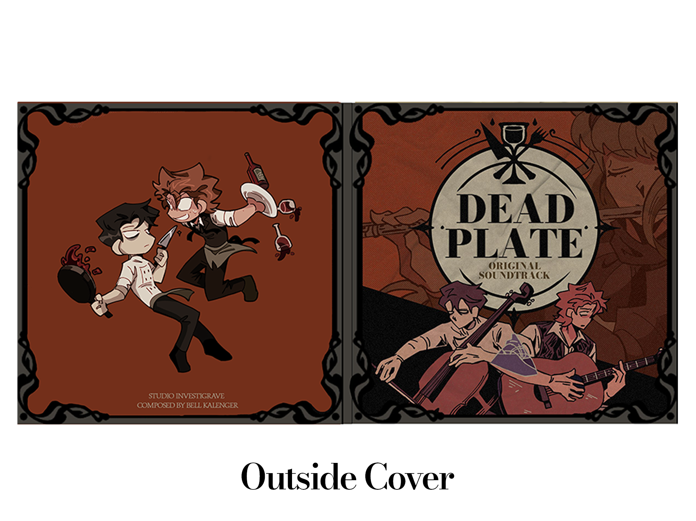
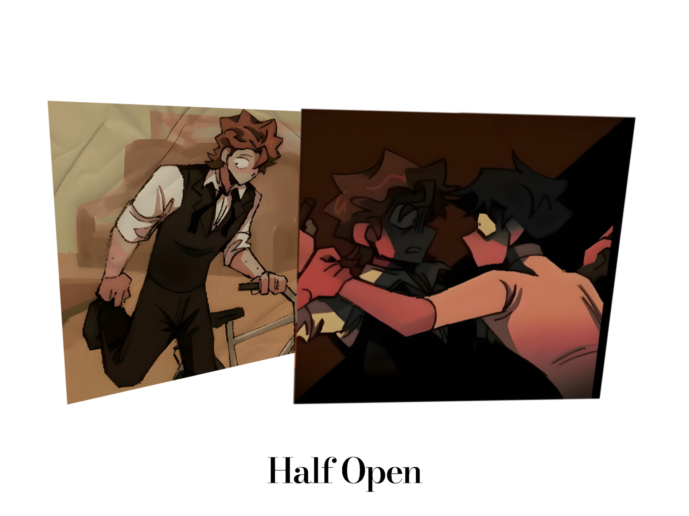

**Dead Plate Soundtrack Album Art**

The album art for the *Dead Plate* soundtrack is designed to capture the intense, eerie atmosphere of the game. Created for RachelDrawsThis's haunting video game, the artwork reflects the suspenseful and dark narrative that players experience throughout the game.

## About Dead Plate

*Dead Plate* is an atmospheric video game developed by RachelDrawsThis, known for her unique style and captivating storytelling. The game places players in a tense world where every decision carries weight, and the soundtrack complements this experience perfectly.

## Album Art Details

I aimed to translate the game's tension and mystery into the album art, using a combination of stark imagery and subtle details. The design is shown from four different angles to give a comprehensive view of how the visuals unfold:

## Visual Showcase

.psd files for this project will be avalible soon

---

Made with <3 by Mason
